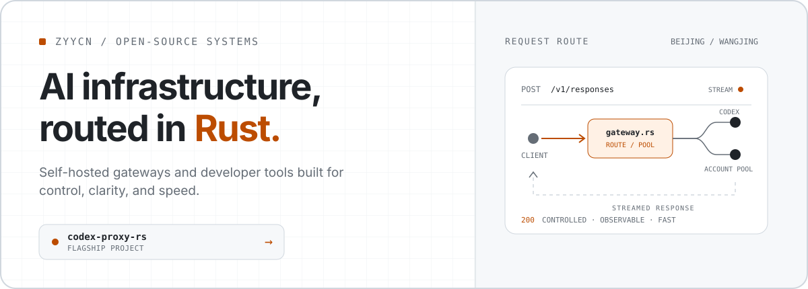

<a href="https://github.com/zyycn/codex-proxy-rs">
  <picture>
    <source
      media="(prefers-color-scheme: dark)"
      srcset="./assets/profile-dark.svg"
    />
    <source
      media="(prefers-color-scheme: light)"
      srcset="./assets/profile-light.svg"
    />
    
  </picture>
</a>
